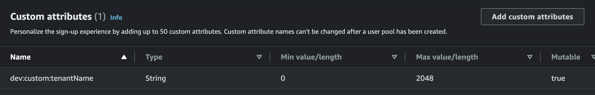
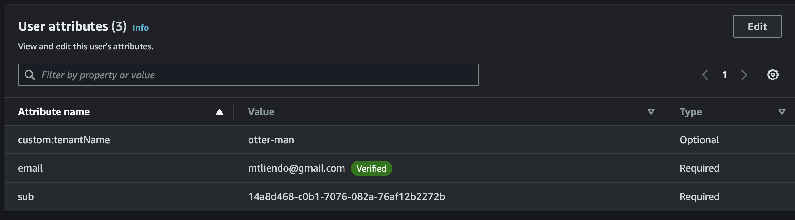

# Amplify with custom cognito attribute

## Application Setup

App is configured from my [Vite + Amplify starter repo](https://github.com/mtliendo/amplify-gen2-vite-starter.git)

From there, I want to create a setup my `protected` page so that it contains a another field. This field is what will be listed as the cognito attribute.

### UI Setup

I'm going to start with [this page](https://ui.docs.amplify.aws/react/connected-components/authenticator/customization#sign-up-fields) and see how far that gets me in customization.

```ts
components={{
				SignUp: {
					FormFields() {
						return (
							<>
								{/* Re-use default `Authenticator.SignUp.FormFields` */}
								<Authenticator.SignUp.FormFields />

								<Label>
									Tenant Name
									<Input
										name="custom:tenantName"
										isRequired
										placeholder="Your Tenant Name"
									/>
								</Label>
							</>
						)
					},
				},
			}}
```

Nothing too crazy, I settled on just making a new `Input` field required. I dabbled with custom validation but it just seemed unnecessary.

### Backend Auth setup

My understanding is that this will setup the UI so that it passes the custom attribute to the pool, but the userpool itself won't let accept it if it's not a known value. So I have to modify the userpool.

This looks more difficult in gen2 than in gen1, but at the same time, we now have visiblity into how this is setup: https://docs.amplify.aws/react/build-a-backend/auth/modify-resources-with-cdk/#custom-attributes

As an initial attempt, I'm doing the following:

```ts
// extract L1 CfnUserPool resources
const { cfnUserPool } = backend.auth.resources.cfnResources
// update the schema property to add custom attributes
if (Array.isArray(cfnUserPool.schema)) {
	cfnUserPool.schema.push({
		name: 'custom:tenantName',
		attributeDataType: 'String',
		developerOnlyAttribute: true,
	})
}
```

I pushed up my code and got the following error:

```txt
 "Entity Type: USER, Message: AttributeName: Admin.custom:tenantName, DataType: STRING, Error: Attribute names MUST conform to the following rules: _|ALPHA *(nameChar) and nameChar is "$" / "-" / "_" /DIGIT / ALPHA (Service: CognitoIdentityProvider, Status Code: 400, Request ID: 74bb1b9d-55c9-4d0b-81a1-8b1b8a933875)"
```

Looks like it's because of `Admin.cusomt:tenantName`. My guess is to leave off the `custom` part.

ok...I just read this part in [the docs](https://docs.aws.amazon.com/AWSCloudFormation/latest/UserGuide/aws-properties-cognito-userpool-schemaattribute.html#cfn-cognito-userpool-schemaattribute-attributedatatype):

```txt
Name
The name of your user pool attribute. When you create or update a user pool, adding a schema attribute creates a custom or developer-only attribute. When you add an attribute with a Name value of MyAttribute, Amazon Cognito creates the custom attribute custom:MyAttribute. When DeveloperOnlyAttribute is true, Amazon Cognito creates your attribute as dev:MyAttribute. In an operation that describes a user pool, Amazon Cognito returns this value as value for standard attributes, custom:value for custom attributes, and dev:value for developer-only attributes..
```

I'm going to test this by signing up a user and see what happens...

My UI failed to sign the user up and threw an error:

```txt
Attributes did not conform to the schema: User: The attribute User is not defined in schema.
```

In Cognito I get the following:



I'm not sure where `User` is coming from, but essentially it's saying the UI passing `dev:custom:tenantName`, is different from what I'm passing.

I'm going to remove the "writeable true" part of the custom setup and redeploy.

Cognito won't let me modify that so I'm just going to redeploy this stack.

I did and the cognito custom attributes in the AWS Console now list the attribute as `custom:tenantName`.

I'm going to try and create a user...

Everything presumably worked. I'm going to look in the aws console..



It worked 🙂

Next I'll just want to verify I can read this value in my UI

## Verify Result

My understanding is that only minimal info is stored on the user. So to get the Cognito attributes on the frontend, I'll use `fetchAuthSession`. Also, since I'm trying to get better at react router, I'll put this in a `loader` instead of a `useEffect`.

Hmmm...I running into some weird navigation errors.

After 30 minutes of debugging I came upon the solution that is present in this repo. Essentially:

1. Direct customers to the login page. Since this page doesn't know the tenant name, once auth'd, all it does is send them to `/protected`.
1. The `/protected` page has no UI. I just use this loader to fetch the attributes of the now signed in user and redirect them to their correct path: `/tenantName/protected`.
1. This is the page that shows the tenant specific info.

## Moving Beyond

This is a start, but in a multitenant app, I'll want to do some auth checks.

### Working with Cognito triggers

When signing up, I'll need to make sure a tenant name is available. In order to do that, I'll need to create a presignup trigger to check the custom attr against a db of tenant names. I'll also need a postconfirmation trigger to add the user to the `admin` group. This trigger will also create a new tenant in the db.

This will allow the user to view only their tenant routes.

> I now have a page level loader on the `tenantId` route that checks if the users fetched tenantname(✅)

### Working with AppSync API

Next step would be to only allow API operations based on tenantId from cognito.

This is _very_ similar to how Amplify generates `owner` based data flows now, but we'll add a condition that the user has to have the right tenantId (ctx.identity.claims.tenantId) in the resolver, and be part of the right group on the schema.
